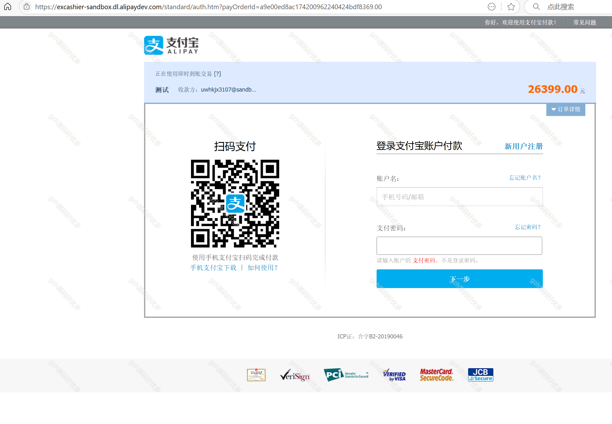

# python037
python037基于Django+Vue3的购物商城销售系统
 
## 查看主页获取源码

### 一、关键词

购物商城系统、购物商城销售系统

 

### 二、作品包含

源码+数据库+万字文档+全套环境和工具资源+部署教程

 

### 三、项目技术

前端技术：vue3、Element UI + Axios
后端技术：Python3.11、Django4.0
  

 

### 四、运行环境（以下版本亲测，其他版本未知，请自测）

开发工具：PyCharm + VSCODE

数据库：MySQL8

数据库管理工具：Navicat10+

Python3.11、Django4.0

前端Nodejs：16

浏览器：谷歌浏览器

 

### 五、项目介绍

项目编号：python037
系统对商城网站平台进行详细的需求调研之后，确定了平台所要实现的具体功能，依据面向对象的软件工程方法的流程进行开发

前台主要功能:商品展示，商品详情，添加购物车，商品购买(调用支付宝沙箱接口模抄
支付，生成订单)
后台主要功能:商品分类管理，商品管理(添加修改商品信息上传商品图片)，订单管理
，购物车管理

 

### 六、运行截图

